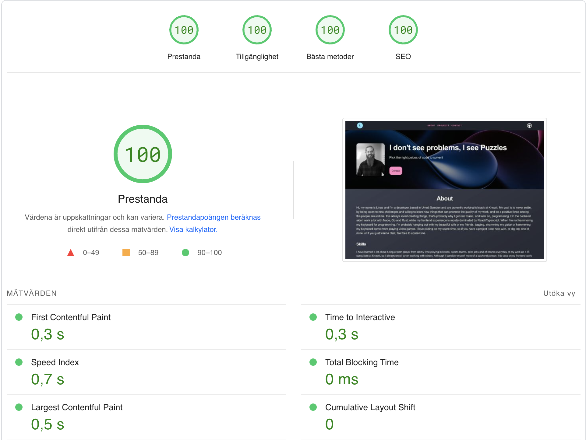
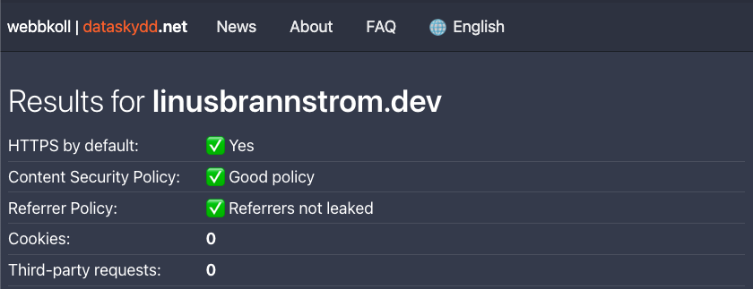

# Linus portfolio

A bare bones, simple, static website, powered by [`create-svelte`](https://github.com/sveltejs/kit/tree/master/packages/create-svelte). Check it out at [linusbrannstrom.dev](https://linusbrannstrom.dev). Feel free to fork and tweak to your own desires.

## 🧑‍💻  Developing

Clone the project and installed dependencies with `npm install` (or `pnpm install` or `yarn`), start a development server:

```bash
yarn dev

# or start the server and open the app in a new browser tab
yarn dev -- --open
```

Optimize images by adding them to the {project_root}/lib/images directory and run the script:

````bash
yarn generate:images
````

The corresponding image(s) should then be accessible through the [image component](./lib/Image.svelte):

````svelte
<script lang="ts">
	import Image from '$lib/Image.svelte';
</script>

<Image name="my_newly_generated_image" />
````

## 🛠️  Building

To create a production version of your app:

```bash
yarn build
```

You can preview the production build with `yarn preview`.

> To deploy your app, you may need to install a different [adapter](https://kit.svelte.dev/docs/adapters) for your target environment, I use [Netlify](https://github.com/sveltejs/kit/tree/master/packages/adapter-netlify).

## 💻  Tech

It might just be a simple static website, but it still has some cool stuff going for it. The site is build to achieve great performance and security without any big sacrifizes:





### ⚙️  Optimizations

The biggest challenge to optimize a website is, IMO, images and CSP. Here I owe a big thanks to [Rodney Johnson](https://github.com/rodneylab) for sharing [his solution](https://github.com/rodneylab/sveltekit-content-security-policy) which I could tweak to fit my needs.

#### 🏞️  Images

To achieve a good lazy loading solution for my images, I use [Vite imagetools](https://github.com/JonasKruckenberg/imagetools/tree/main/packages/vite) to create optimzed versions of all images, and my custom [svelte Image component](./src/lib/Image.svelte) to dynamically fetch images when mounted to the browser. The crown jewel here is the [generate images script](./generate-image-data.js) that generates js-files with meta-data about all images, and a base64 encoded placeholder to use while loading the fullsized image. The script also generates a [ValidImage type](./src/lib/__generated__/img/types.d.ts) which I can use for typesafety in the Image component.

#### 🔐  Security

Sveltekit provides an easy way to [configure CSP headers](https://kit.svelte.dev/docs/configuration#csp), but that is not enough. For that to work with Netlify hosting, we need some extra hands-on work. We need to provide a _headers file at build-time to the build-folder for Netlify to pick up, which is done by the [generate headers script](./generate-headers.js). Since sveltekit injects its hydration-script as an inline script, with a different hash every time, we need to extract CSP from the meta tag, which is generated by sveltekit, to get the right hash. The generate headers script is therefore run directly after the build command.  Thus we can achive great security with the proper headers and CSP set. Unfortunately, since I'm using svelte transitions to perform some cool animations, I'm forced to use inline styles. This is a [known issue](https://github.com/sveltejs/svelte/issues/6662), and until sveltekit has made the transition over to the Web Animations API, I am alas stuck with allowing 'unsafe-inline' on the style-src directive.

### 💬  Other

Fun fact, since I spend most of my day in a code-editor, I wanted to reflect that in the design. Which is why i used [Dracula theme](https://draculatheme.com/) as my colorpalette, which of course, is the theme I use in my editor.

All data is at the moment hardcoded into [page.ts](./src/routes/+page.ts), but are structured in a way to make it possible to refactor for fetching from a CMS instead. But I wanted to make it as simple as possible to deploy this solution, and also avoid hosting costs of setting up a backend for my data, therefore i just edit the content in page.ts and push to main-branch for automatic deployment. Since I rarely need to edit the content, this works fine for now.
